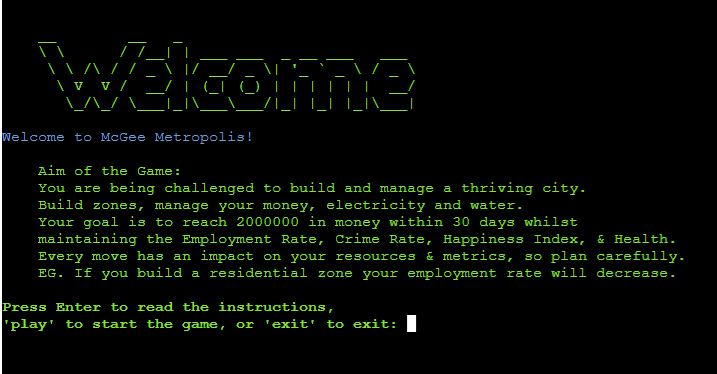
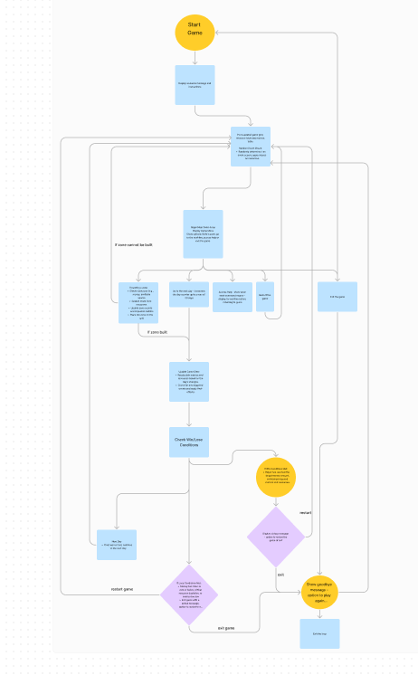
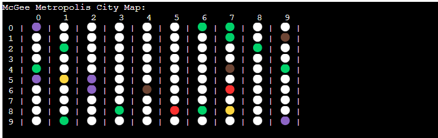
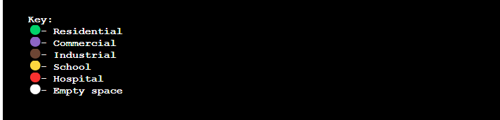
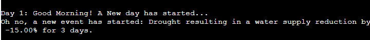

# **_McGee Metropolis- Project Portfolio 3_**

This file provides a guide to McGee Metropolis, a dynamic city-building game I have developed. This game challenges players to manage and expand a virtual city by strategically placing zones, balancing resources, and responding to unexpected events. Developed with Python, McGee Metropolis provides an immersive experience where players must navigate the complexities of urban management. The objective is to achieve financial success while maintaining the city's overall well-being, ensuring a balanced and thriving city.

The live game can be viewed here - <a href=" https://mcgee-metropolis-13f84b689485.herokuapp.com/" target="_blank" rel="noopener">McGee Metropolis</a>

# Contents

* [**Game Objectives**](<#game-objectives>)
* [**User Experience UX**](<#user-experience-ux>)
    * [**Client Background and Goals**](<#client-background-and-goals>)
    * [**Target Audience**](<#target-audience>)
    * [**User Stories**](<#user-stories>)
* [**Design**](<#design>)
    * [**Planning and Development**](<#planning-and-development>)
        * [Strategy](<#strategy>)
        * [Scope](<#scope>)
        * [Structure](<#structure>)
        * [Skeleton](<#skeleton>)
        * [Surface](<#surface>)
* [**Features**](<#features>)
    * [**Generic Game Features**](<#generic-game-features>
        * [City Grid](<#city-grid>)
        * [Zones](<#zones>)
        * [Resources](<#resources>)
        * [Metrics](<#metrics>)
        * [Daily Income](<#daily-income>)
        * [Random Events](<#random-events>)
        * [Zone Placement Limits](<#zone-placement-limits>)
        * [Progression and Days](<#progression-and-days>)
        * [Help and Instructions](<#help-and-instructions>)
        * [Restart and Exit Options](<#restart-and-exit-options>)
        * [User Feedback and Confirmation](<#user-feedback-and-confirmation>)
        * [Resource Regeneration](<#resource-regeneration>)
        * [Game Over Conditions](<#game-over-conditions>)
        * [Metric Impacts from Zones](<#metric-impacts-from-zones>)
        * [Data Integration with Google Sheets](<#data-integration-with-google-sheets>)
* [**Technologies Used**](<#technologies-used>)
* [**Deployment**](<#deployment>)
    * [**Opening the repository**](<#opening-the-repository>)
    * [**Forking the repository**](<#forking-the-repository>)
    * [**Cloning the repository**](<#cloning-the-repository>)
* [**Testing**](<#testing>)
    * [**Validator Testing**](<#validator-testing>)
        * [HTML Validation](<#html-validation>)
        * [CSS Validation](<#javascript-validation>)
        * [Javascript Validation](<#css-validation>)
    * [**Responsivity Testing**](<#responsivity-testing>)
    * [**Accessibility Testing**](<#accessibility-testing>)
    * [**Performance Testing**](<#performance-testing>)
    * [**Testing of User Stories**](<#testing-of-user-stories>)
    * [**Manual Testing of Game Features**](<#manual-testing-of-game-features>)
    * [**Bugs**](<#bugs>)
    * [**Future Developments**](<#future-developments>)
* [**Credits**](<#credits>)
* [**Acknowledgements**](<#acknowledgements>)

# Game Objectives

The primary objective of McGee Metropolis is to immerse players in the intricate world of city management, providing a strategic and entertaining challenge. The aims of the project are:
* Strategic Planning: Offer a platform for players to test their city planning and resource management skills. Whether users are focusing on residential expansion or industrial growth, the game presents a variety of scenarios that require thoughtful decision-making.
* User Experience Focus: Emphasise the importance of a smooth and engaging user experience, featuring an intuitive interface that encourages players to continuously refine their city-building strategies. The thrill of balancing resources while dealing with random events ensures each playthrough remains fresh and captivating.
* Real-world Application: Simulate the complexities of real-world urban management, encouraging players to understand and appreciate the balance required to maintain a thriving city. The game's interactive nature fosters an environment where players can learn through play, enhancing their problem-solving and critical-thinking abilities.

[Back to top](<#contents>)

# User Experience (UX)

## Client Background and Goals

As the creator of McGee Metropolis, this project is inspired by the games I used to enjoy playing as a child, particularly those which focused on strategy,  planning and resource management. I hope that in developing McGee Metropolis as a strategic game as my skills progress I am able to add new features to build an engaging and fun  experience for players of all ages. The following are my key personal goals for the project:
* Encourage Strategic Thinking: The game is designed to cultivate strategic planning and decision-making skills. By managing resources and responding to random events, players will learn the importance of foresight and adaptability in urban management.
* Promote Real-world Understanding: By simulating real-world urban management challenges, the game aims to foster a deeper appreciation for the complexities of city planning. Players will gain insights into the delicate balance needed to maintain a thriving city.
* Encourage Repeated Play and Continuous Learning: Incorporating elements that track progress and provide feedback aims to motivate players to improve their strategies. Achieving the game’s monetary and metric goals is presented as a significant accomplishment, encouraging repeated play and continuous improvement.
[Back to top](<#contents>)

## Target Audience
 
In developing McGee Metropolis, defining the target audience was crucial to ensure the game's design, content, and features align with the needs and interests of its players. Through research and feedback from initial testers, the primary user for this game have been identified as follows:
* Strategy Game Enthusiasts: Individuals who enjoy strategic planning and resource management games will find McGee Metropolis particularly engaging. The game offers complex challenges that require thoughtful decision-making and long-term planning.
* People Interested in Urban Development: People who are curious about how cities are built and managed can gain insights through gameplay. McGee Metropolis provides a hands-on experience of the intricacies involved in urban development and the challenges faced by city planners.
* Gamers Seeking a Challenge: Players looking for a game that offers more than just entertainment will appreciate the depth and complexity of McGee Metropolis. The game requires strategic thinking and problem-solving, making it a satisfying experience for those who enjoy a good challenge.

[Back to top](<#contents>)

## User Stories

Based on the target audience, I have defined three possible user stories for McGee Metropolis:

<b>1. Strategy Game Enthusiasts</b>

* As a strategy game enthusiast, I want McGee Metropolis to offer complex challenges that require strategic thinking, so I can enjoy the depth and intricacies of city-building.
* I expect the game to provide a variety of scenarios and events that test my resource management skills, keeping the gameplay engaging and dynamic.
* The game should have a detailed and intuitive interface, allowing me to easily navigate and manage different aspects of my city.

<b>2. General Public Interested in Urban Development</b>

* As someone interested in urban development, I want McGee Metropolis to give me insights into how cities are planned and managed, offering a realistic simulation of the challenges faced by city planners.
* I expect the game to present real-world scenarios and problems, allowing me to explore various solutions and their outcomes.
* The game should have detailed graphics and an immersive environment, enhancing my understanding and enjoyment of the city-building process.

<b>3. Gamers Seeking a Challenge</b>

* As a gamer looking for a challenge, I want McGee Metropolis to provide difficult and rewarding gameplay that tests my strategic and problem-solving skills.
* I expect the game to feature escalating difficulty levels, keeping me engaged and motivated to improve my performance.
* The game should offer achievements and rewards for reaching milestones, encouraging me to continue playing and mastering the game.

[Back to top](<#contents>)

# Design

## Planning and Development

The development of "McGee Metropolis" was a carefully structured process aimed at delivering a fun, user-friendly city-building simulation. The project adhered to the five planes of UX design—Strategy, Scope, Structure, Skeleton, and Surface—with the goal of creating a seamless and engaging experience.
### Strategy

In the strategy phase, the primary objective was to create an immersive city-building game that entertains while providing educational insights into urban planning and resource management. The game was designed to challenge players with strategic decision-making, balancing various city metrics. Understanding the target audience including gamers and individuals interested in urban development was crucial in designing the flow and features of the game.
### Scope

With the strategy in place, the scope phase focused on identifying key features and functionalities essential to the game's success. These included:
* A dynamic event system that introduces random challenges to the player's city.
* Comprehensive resource management, encompassing money, electricity, and water.
* Detailed metrics tracking to evaluate the city's performance in terms of employment, crime rate, happiness, and health.
* User-friendly interfaces that provide clear feedback and intuitive controls for managing the city.

### Structure

The structure phase involved designing an intuitive flow that guides players through the game's various stages—from initial setup and daily city management to responding to random events. The flow was outlined to ensure a logical progression, making it easy for players to understand and engage with the game mechanics. The game architecture was designed for flexibility, allowing for future updates and content expansions.

### Skeleton

During the skeleton phase, a flow diagram was created based on the pseudocode produced in the structure phase. This stage was crucial for determining the placement of key elements such as the city grid, resource displays, and event notifications. The game flow was tested for various scenarios and inputs and continually refined to ensure excellent user experience.

<b>This flow diagram is available to view within Figma via <a href="https://www.figma.com/board/3eC3a7jLZHJbuOdCNYohxa/McGee-Metropolis?node-id=916%3A336&t=7QNKzCub5ZU4AU35-1" target="_blank" rel="noopener">THIS LINK.</a></b>

Feedback was sought from peers, friends, and mentors at all stages of the design process. The final design incorporated their insights, leading to adjustments such as the placement of resource indicators and the layout of the city grid, enhancing overall user experience.

### Surface

The surface design phase brought the game to life with the addition of use friendly controls, colour schemes and symbols, to ensure readability and attract players while maintaining a cohesive and immersive city-building theme. 

[Back to top](<#contents>)

# Features

## Generic Game Features

The game is designed with a variety of key features, as outlined in the sections and screenshots below:

### City Grid

* Description: A 10x10 grid representing the city map.
* How it Works: The grid is initialised with random zones as set by the data within the Google sheet and players can then add and build different zones on it.
* Rationale: Provides a visual and interactive way to plan and manage the city, allowing players to see the impact of their decisions spatially.

### Zones

* Description: There are different types of zones that players can build: Residential, Commercial, Industrial, School, and Hospital.
* How it Works: Each zone type has specific costs, daily income generation, and impacts on metrics. Players choose a zone type and place it on the grid.
* Rationale: Adds depth to the game by introducing strategic decisions on zone placement and resource management.

### Resources

* Description: The game tracks three main resources: Money, Electricity, and Water.
* How it Works: Resources are initialized at the start and are consumed or regenerated daily based on player actions and events.
* Rationale: Encourages players to balance resource consumption and regeneration, adding a layer of strategy and planning.

### Metrics

* Description: Key metrics include Employment Rate, Crime Rate, Happiness Index, and Health.
* How it Works: Metrics are influenced by player actions and events. Players must keep metrics within acceptable ranges to avoid losing the game.
* Rationale: Provides additional challenges and objectives, ensuring that players must consider the broader impact of their decisions.

### Daily Income

* Description: Zones generate income daily based on their type.
* How it Works: At the end of each day, the total daily income from all zones is added to the player's money.
* Rationale: Rewards players for strategic zone placement and encourages expansion.

### Random Events
* Description: Random events that negatively impact resources and metrics.
* How it Works: Each day, there is a chance for a random event to occur, affecting the city for a set duration.
* Rationale: Introduces unpredictability and challenges, requiring players to adapt their strategies.

### Zone Placement limits

* Description: Limits the number of zones that can be built per day to three.
* How it Works: Tracks the number of zones built each day and prevents further building once the limit is reached.
* Rationale: Adds a layer of strategy by forcing players to prioritize their actions each day.

### Progression and Days

* Description: The game progresses in days, with a total of 30 days to reach the monetary goal.
* How it Works: Players can advance to the next day once their actions are completed, and the game updates resources, metrics, and potential events.
* Rationale: Provides a clear time frame and structure, adding urgency to the player's actions.

### Help and Instructions
* Description: In-game help and instructions available to guide players.
* How it Works: Players can access help at any time to understand the game rules, features, and objectives.
* Rationale: Enhances user experience by providing guidance and ensuring players understand how to play the game.

### Restart and Exit Options
* Description: Allows players to restart the game or exit at any time.
* How it Works: Players can choose to restart, resetting all progress, or exit the game with a confirmation prompt.
* Rationale: Provides flexibility and control, ensuring that players can start fresh if needed or exit the game smoothly.

### User Feedback and Confirmation

* Description: Feedback and confirmation messages for user actions.
* How it Works: The game provides feedback on actions like building zones, encountering events, and achieving goals.
* Rationale: Keeps players informed and engaged, enhancing the overall user experience by confirming actions and providing necessary information.

### Resource Regeneration

* Description: Daily regeneration of electricity and water.
* How it Works: At the end of each day, electricity and water resources regenerate by a fixed amount.
* Rationale: Ensures that resources are not depleted too quickly and allows players to recover from deficits over time.

### Game Over Conditions
* Description: Conditions that determine the end of the game, either by achieving the monetary goal or failing to maintain metrics.
* How it Works: The game checks if the monetary goal is met or if any metric falls outside acceptable ranges, triggering a game over.
* Rationale: Defines clear win/loss conditions, providing players with goals and consequences for their actions.

### Metric Impacts from Zones
* Description: Each zone type impacts specific metrics when built.
* How it Works: Building zones adjusts metrics based on predefined rules (e.g., residential zones decrease employment rate).
* Rationale: Adds complexity and requires players to consider the broader impact of their zoning decisions on the city's well-being.

### Data Integration with Google Sheets
* Description: Uses Google Sheets to store and retrieve game data.
* How it Works: Player resources, metrics, and events are managed through Google Sheets, allowing for easy updates.
* Rationale: Ensures data integrity and facilitates easy management and updates of game data.

[Back to top](<#contents>)
