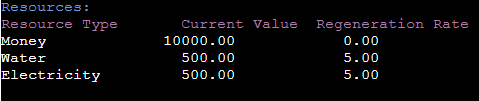
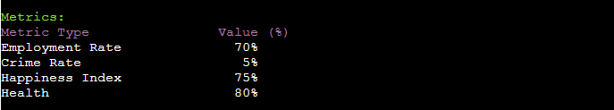
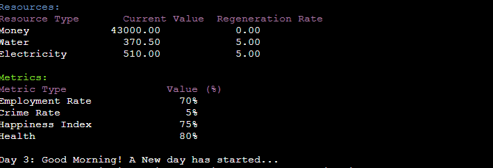
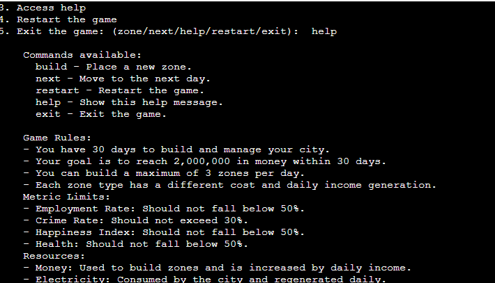
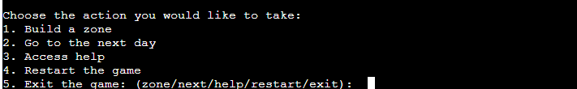
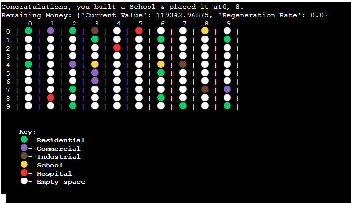
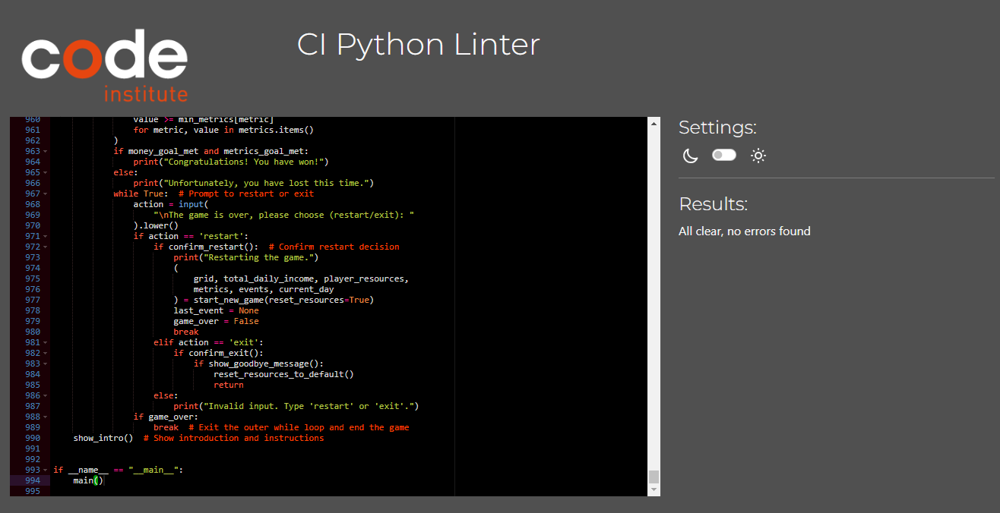

# **_McGee Metropolis- Project Portfolio 3_**

This file provides a guide to McGee Metropolis, a dynamic city-building game I have developed. This game challenges players to manage and expand a virtual city by strategically placing zones, balancing resources, and responding to unexpected events. Developed with Python, McGee Metropolis provides an immersive experience where players must navigate the complexities of urban management. The objective is to achieve financial success while maintaining the city's overall well-being, ensuring a balanced and thriving city.

The live game can be viewed here - <a href="https://mcgee-metropolis-13f84b689485.herokuapp.com/" target="_blank" rel="noopener">McGee Metropolis</a>

# Contents

* [**Game Objectives**](<#game-objectives>)
* [**User Experience UX**](<#user-experience-ux>)
    * [**Client Background and Goals**](<#client-background-and-goals>)
    * [**Target Audience**](<#target-audience>)
    * [**User Stories**](<#user-stories>)
* [**Design**](<#design>)
    * [**Planning and Development**](<#planning-and-development>)
        * [Strategy](<#strategy>)
        * [Scope](<#scope>)
        * [Structure](<#structure>)
        * [Skeleton](<#skeleton>)
        * [Surface](<#surface>)
* [**Features**](<#features>)
    * [**Generic Game Features**](<#generic-game-features>)
        * [City Grid](<#city-grid>)
        * [Zones](<#zones>)
        * [Resources](<#resources>)
        * [Metrics](<#metrics>)
        * [Daily Income](<#daily-income>)
        * [Random Events](<#random-events>)
        * [Zone Placement Limits](<#zone-placement-limits>)
        * [Progression and Days](<#progression-and-days>)
        * [Help and Instructions](<#help-and-instructions>)
        * [Restart and Exit Options](<#restart-and-exit-options>)
        * [User Feedback and Confirmation](<#user-feedback-and-confirmation>)
        * [Resource Regeneration](<#resource-regeneration>)
        * [Game Over Conditions](<#game-over-conditions>)
        * [Metric Impacts from Zones](<#metric-impacts-from-zones>)
        * [Data Integration with Google Sheets](<#data-integration-with-google-sheets>)
* [**Technologies Used**](<#technologies-used>)
* [**Deployment**](<#deployment>)
    * [**Deployment to Heroku**](<#deployment-to-heroku>)
    * [**Forking the repository**](<#forking-the-repository>)
    * [**Cloning the repository**](<#cloning-the-repository>)
* [**Libraries**](<#deployment>)
* [**Testing**](<#testing>)
    * [**Validator Testing**](<#validator-testing>)
    * [**Testing of User Stories**](<#testing-of-user-stories>)
    * [**Manual Testing of Game Features**](<#manual-testing-of-game-features>)
    * [**Bugs**](<#bugs>)
    * [**Future Developments**](<#future-developments>)
* [**Credits**](<#credits>)
* [**Acknowledgements**](<#acknowledgements>)

# Game Objectives

The primary objective of McGee Metropolis is to immerse players in the intricate world of city management, providing a strategic and entertaining challenge. The aims of the project are:
* Strategic Planning: Offer a platform for players to test their city planning and resource management skills. Whether users are focusing on residential expansion or industrial growth, the game presents a variety of scenarios that require thoughtful decision-making.
* User Experience Focus: Emphasise the importance of a smooth and engaging user experience, featuring an intuitive interface that encourages players to continuously refine their city-building strategies. The thrill of balancing resources while dealing with random events ensures each playthrough remains fresh and captivating.
* Real-world Application: Simulate the complexities of real-world urban management, encouraging players to understand and appreciate the balance required to maintain a thriving city. The game's interactive nature fosters an environment where players can learn through play, enhancing their problem-solving and critical-thinking abilities.

[Back to top](<#contents>)

# User Experience (UX)

## Client Background and Goals

As the creator of McGee Metropolis, this project is inspired by the games I used to enjoy playing as a child, particularly those which focused on strategy,  planning and resource management. I hope that in developing McGee Metropolis as a strategic game as my skills progress I am able to add new features to build an engaging and fun  experience for players of all ages. The following are my key personal goals for the project:
* Encourage Strategic Thinking: The game is designed to cultivate strategic planning and decision-making skills. By managing resources and responding to random events, players will learn the importance of foresight and adaptability in urban management.
* Promote Real-world Understanding: By simulating real-world urban management challenges, the game aims to foster a deeper appreciation for the complexities of city planning. Players will gain insights into the delicate balance needed to maintain a thriving city.
* Encourage Repeated Play and Continuous Learning: Incorporating elements that track progress and provide feedback aims to motivate players to improve their strategies. Achieving the game’s monetary and metric goals is presented as a significant accomplishment, encouraging repeated play and continuous improvement.

[Back to top](<#contents>)

## Target Audience
 
In developing McGee Metropolis, defining the target audience was crucial to ensure the game's design, content, and features align with the needs and interests of its players. Through research and feedback from initial testers, the primary user for this game have been identified as follows:
* Strategy Game Enthusiasts: Individuals who enjoy strategic planning and resource management games will find McGee Metropolis particularly engaging. The game offers complex challenges that require thoughtful decision-making and long-term planning.
* People Interested in Urban Development: People who are curious about how cities are built and managed can gain insights through gameplay. McGee Metropolis provides a hands-on experience of the intricacies involved in urban development and the challenges faced by city planners.
* Gamers Seeking a Challenge: Players looking for a game that offers more than just entertainment will appreciate the depth and complexity of McGee Metropolis. The game requires strategic thinking and problem-solving, making it a satisfying experience for those who enjoy a good challenge.

[Back to top](<#contents>)

## User Stories

Based on the target audience, I have defined three possible user stories for McGee Metropolis:

<b>1. Strategy Game Enthusiasts</b>

* As a strategy game enthusiast, I want McGee Metropolis to offer complex challenges that require strategic thinking, so I can enjoy the depth and intricacies of city-building.

* I expect the game to provide a variety of scenarios and events that test my resource management skills, keeping the gameplay engaging and dynamic.

* The game should have a detailed and intuitive interface, allowing me to easily navigate and manage different aspects of my city.

<b>2. General Public Interested in Urban Development</b>

* As someone interested in urban development, I want McGee Metropolis to give me insights into how cities are planned and managed, offering a realistic simulation of the challenges faced by city planners.

* I expect the game to present real-world scenarios and problems, allowing me to explore various solutions and their outcomes.

* The game should have detailed graphics and an immersive environment, enhancing my understanding and enjoyment of the city-building process.

<b>3. Gamers Seeking a Challenge</b>

* As a gamer looking for a challenge, I want McGee Metropolis to provide difficult and rewarding gameplay that tests my strategic and problem-solving skills.

* I expect the game to feature escalating difficulty levels, keeping me engaged and motivated to improve my performance.

* The game should offer achievements and rewards for reaching milestones, encouraging me to continue playing and mastering the game.

[Back to top](<#contents>)

# Design

## Planning and Development

The development of "McGee Metropolis" was a carefully structured process aimed at delivering a fun, user-friendly city-building simulation. The project adhered to the five planes of UX design—Strategy, Scope, Structure, Skeleton, and Surface—with the goal of creating a seamless and engaging experience.
### Strategy

In the strategy phase, the primary objective was to create an immersive city-building game that entertains while providing educational insights into urban planning and resource management. The game was designed to challenge players with strategic decision-making, balancing various city metrics. Understanding the target audience including gamers and individuals interested in urban development was crucial in designing the flow and features of the game.
### Scope

With the strategy in place, the scope phase focused on identifying key features and functionalities essential to the game's success. These included:
* A dynamic event system that introduces random challenges to the player's city.
* Comprehensive resource management, encompassing money, electricity, and water.
* Detailed metrics tracking to evaluate the city's performance in terms of employment, crime rate, happiness, and health.
* User-friendly interfaces that provide clear feedback and intuitive controls for managing the city.

### Structure

The structure phase involved designing an intuitive flow that guides players through the game's various stages—from initial setup and daily city management to responding to random events. The flow was outlined to ensure a logical progression, making it easy for players to understand and engage with the game mechanics. The game architecture was designed for flexibility, allowing for future updates and content expansions.

### Skeleton

During the skeleton phase, a flow diagram was created based on the pseudocode produced in the structure phase. This stage was crucial for determining the placement of key elements such as the city grid, resource displays, and event notifications. The game flow was tested for various scenarios and inputs and continually refined to ensure excellent user experience.

<b>This flow diagram is available to view within Figma via <a href="https://www.figma.com/board/3eC3a7jLZHJbuOdCNYohxa/McGee-Metropolis?node-id=916%3A336&t=7QNKzCub5ZU4AU35-1" target="_blank" rel="noopener">THIS LINK.</a></b>

Feedback was sought from peers, friends, and mentors at all stages of the design process. The final design incorporated their insights, leading to adjustments such as the placement of resource indicators and the layout of the city grid, enhancing overall user experience.

### Surface

The surface design phase brought the game to life with the addition of use friendly controls, colour schemes and symbols, to ensure readability and attract players while maintaining a cohesive and immersive city-building theme. 

[Back to top](<#contents>)

# Features

## Generic Game Features

The game is designed with a variety of key features, as outlined in the sections and screenshots below:

### City Grid

* Description: A 10x10 grid representing the city map.
* How it Works: The grid is initialised with random zones as set by the data within the Google sheet and players can then add and build different zones on it.
* Rationale: Provides a visual and interactive way to plan and manage the city, allowing players to see the impact of their decisions spatially.

### Zones

* Description: There are different types of zones that players can build: Residential, Commercial, Industrial, School, and Hospital.
* How it Works: Each zone type has specific costs, daily income generation, and impacts on metrics. Players choose a zone type and place it on the grid.
* Rationale: Adds depth to the game by introducing strategic decisions on zone placement and resource management.

### Resources

* Description: The game tracks three main resources: Money, Electricity, and Water.
* How it Works: Resources are initialized at the start and are consumed or regenerated daily based on player actions and events.
* Rationale: Encourages players to balance resource consumption and regeneration, adding a layer of strategy and planning.

### Metrics

* Description: Key metrics include Employment Rate, Crime Rate, Happiness Index, and Health.
* How it Works: Metrics are influenced by player actions and events. Players must keep metrics within acceptable ranges to avoid losing the game.
* Rationale: Provides additional challenges and objectives, ensuring that players must consider the broader impact of their decisions.

### Daily Income

* Description: Zones generate income daily based on their type.
* How it Works: At the end of each day, the total daily income from all zones is added to the player's money.
* Rationale: Rewards players for strategic zone placement and encourages expansion.

### Random Events
* Description: Random events that negatively impact resources and metrics.
* How it Works: Each day, there is a chance for a random event to occur, affecting the city for a set duration.
* Rationale: Introduces unpredictability and challenges, requiring players to adapt their strategies.

### Zone Placement limits

* Description: Limits the number of zones that can be built per day to three.
* How it Works: Tracks the number of zones built each day and prevents further building once the limit is reached.
* Rationale: Adds a layer of strategy by forcing players to prioritize their actions each day.

### Progression and Days

* Description: The game progresses in days, with a total of 30 days to reach the monetary goal.
* How it Works: Players can advance to the next day once their actions are completed, and the game updates resources, metrics, and potential events.
* Rationale: Provides a clear time frame and structure, adding urgency to the player's actions.

### Help and Instructions
* Description: In-game help and instructions available to guide players.
* How it Works: Players can access help at any time to understand the game rules, features, and objectives.
* Rationale: Enhances user experience by providing guidance and ensuring players understand how to play the game.

### Restart and Exit Options
* Description: Allows players to restart the game or exit at any time.
* How it Works: Players can choose to restart, resetting all progress, or exit the game with a confirmation prompt.
* Rationale: Provides flexibility and control, ensuring that players can start fresh if needed or exit the game smoothly.

### User Feedback and Confirmation

* Description: Feedback and confirmation messages for user actions.
* How it Works: The game provides feedback on actions like building zones, encountering events, and achieving goals.
* Rationale: Keeps players informed and engaged, enhancing the overall user experience by confirming actions and providing necessary information.

### Resource Regeneration

* Description: Daily regeneration of electricity and water.
* How it Works: At the end of each day, electricity and water resources regenerate by a fixed amount.
* Rationale: Ensures that resources are not depleted too quickly and allows players to recover from deficits over time.

.
* Rationale: Adds complexity and requires players to consider the broader impact of their zoning decisions on the city's well-being.

# Technologies Used

* Python
   * The core programming language used to develop the game, handling all game logic, data manipulation, and interactions.
* Google Sheets API (gspread)
    * Utilised for data storage and retrieval, allowing the game to save and fetch game state, resources, and event data.
* Google OAuth2
    * Employed for secure authentication and authorization when accessing Google Sheets.
* Heroku
    * The platform used to deploy the game, enabling it to be hosted and accessed online.
* Figma
    * Used for creating detailed a flow chart during the game planning stage.
* Gitpod
    * Used for version control, tracking changes, and managing different versions of the project throughout development.
* Github
    * Hosted the project repository, enabling version control, and project management.
* Figma
    * Used for creating detailed a flow chart during the game planning stage.

[Back to top](<#contents>)

# Deployment

The game was developed using the IDE Gitpod and is hosted on GitHub, which ensured development of the project. It is deployed to Heroku using a template developed by Code Institute, allowing the game to be accessed and played online.

During the game development, all changes were pushed to GitHub with commit messages describing the various changes made at each stage of the project.

The deployment to Github and Heroku followed these steps, which can be easily replicated.

## Deployment to Heroku

1.	Create a Heroku Account and Log In: Start by signing up for a Heroku account if you don't already have one. Once your account is set up, log in to access your dashboard.
2.	Create a New Application: On the dashboard, locate and click the "New" button. The, select "Create new app" from the dropdown menu.
3.	Configure Application Settings: Enter a unique name for your application. This name must be distinct across all Heroku applications. Choose the appropriate region for your application (e.g., United States or Europe). Click the "Create app" button to proceed.
4.	Access and Edit Settings: In the newly created app's dashboard, navigate to the "Settings" tab.
5.	Reveal and Add Configuration Variables: In the "Config Vars" section, click on "Reveal Config Vars" to manage your environment variables. To integrate Google Sheets, add a new config var and set the key to CREDS. For the value, paste the contents of the creds.json file. Then, add another config var and set the key to PORT. For the value, enter 8000.
6.	Add Buildpacks: Still under the "Settings" tab, locate the "Buildpacks" section and click on "Add buildpack". Select "Python" and save your choice. Add another buildpack by clicking "Add buildpack" again and select "node.js". Ensure that the buildpacks are listed in the following order: Python first, followed by Node.js.
7.	Deploy the Application: Navigate to the "Deploy" tab located at the top of the dashboard. Under "Deployment method", select "GitHub" to connect your Heroku app to the GitHub repository. Authenticate and authorise Heroku to access the GitHub account if prompted. Then, search for the project's repository name and click "Connect" to link it to Heroku. Optionally, enable automatic deploys to allow Heroku to automatically deploy new code every time you push updates to the connected repository. To manually deploy the  project immediately, click the "Deploy Branch" button.

Alternatively, the game can be accessed via Heroku via this live <a href="https://mcgee-metropolis-13f84b689485.herokuapp.com/" target="_blank" rel="noopener">LINK</a>

## Forking the repository

This <a href="https://github.com/SophieMcGee/McGee_Metropolis" target="_blank" rel="noopener">LINK</a> is to the project Github repository. 

To create a copy of the repository please use the following steps:

1. Open the Github repository and click the 'Code' tab.
2. Next, click the 'Fork' button located in top right to fork the repository to your own account.

## Cloning the repository

To clone the repository so that you can work locally:

1. Open the Github repository and click the green 'Code' button to open the various options.
2. Ensure HTTPS is selected and copy the URL provided.
3. Open your terminal in Gitpod or any other IDE that offers Git support.
4. Enter git clone [paste the URL you copied earlier].

[Back to top](<#contents>)

# Libraries

The following external libraries were imported into this project:
1. gspread: Used for interacting with Google Sheets API to fetch and update data from Google Sheets.
2. google-auth: Specifically, google.oauth2.service_account.Credentials, which was used to manage credentials for accessing Google APIs, in this case, Google Sheets.
3. random: Used for generating random numbers and shuffling lists, which is crucial for random events and zone placement in the game.
4. time: Used for creating delays in the output to enhance user experience, such as printing messages with a typewriter effect.

# Testing
Throughout the project thorough testing was completed to ensure the game developed and functioned as planned. Once complete, a full test of every feature was completed with the results as follows.

## Validator Testing

The CI Python Linter was used to check for errors in the code, this is a link to the tool website: 

https://pep8ci.herokuapp.com/#

During the coding stage the errors found related to the length of the characters within some lines extending to more than 80 characters and to trailing whitespace at the end of some lines of code. Once the build of the game was completed the code was run through the validator and no errors are present: 

[Back to top](<#contents>)

## Testing of User Stories

> User story 1 - Strategy Game Enthusiasts "As a strategy game enthusiast, I want McGee Metropolis to offer complex challenges that require strategic thinking, so I can enjoy the depth and intricacies of city-building. I expect the game to provide a variety of scenarios and events that test my resource management skills, keeping the gameplay engaging and dynamic. The game should have a detailed and intuitive interface, allowing me to easily navigate and manage different aspects of my city."

Manual testing:

| User Step | Description | Pass or Fail |
|:----------|:------------|:------------:|
|1| User starts the game and reads the instructions, understanding the game's strategic elements |Pass|
|2| User encounters various scenarios and events that require strategic decision-making |Pass|
|3| Interface allows user to easily navigate and manage different city aspects |Pass|
|4| User experiences dynamic and engaging gameplay that tests resource management skills |Pass|
|5| User is able to restart the game with a fresh strategic challenge each time |Pass|

> User story 2 - General Public Interested in Urban Development "As someone interested in urban development, I want McGee Metropolis to give me insights into how cities are planned and managed, offering a realistic simulation of the challenges faced by city planners. I expect the game to present real-world scenarios and problems, allowing me to explore various solutions and their outcomes. The game should have detailed graphics and an immersive environment, enhancing my understanding and enjoyment of the city-building process."

Manual testing:
| User Step | Description | Pass or Fail |
|:----------|:------------|:------------:|
|1| User starts the game and reads the instructions, gaining an understanding of urban planning elements |Pass|
|2| User encounters real-world scenarios and problems to solve within the game |Pass|
|3| Detailed graphics and immersive environment enhance user's understanding and enjoyment |Pass|
|4| User is able to see the impact of their decisions on the city's development |Pass|
|5| Game presents a variety of solutions and outcomes for user to explore |Pass|

> User story 3 - Gamers Seeking a Challenge "As a gamer looking for a challenge, I want McGee Metropolis to provide difficult and rewarding gameplay that tests my strategic and problem-solving skills. I expect the game to feature escalating difficulty levels, keeping me engaged and motivated to improve my performance. The game should offer achievements and rewards for reaching milestones, encouraging me to continue playing and mastering the game."

Manual testing:
| User Step | Description | Pass or Fail |
|:----------|:------------|:------------:|
|1| User starts the game and reads the instructions, understanding the challenge ahead |Pass|
|2| User experiences escalating difficulty levels as they progress through the game |Pass|
|3| Gameplay tests user's strategic and problem-solving skills effectively |Pass|
|4| User receives achievements and rewards for reaching milestones, motivating continued play |Pass|
|5| User feels challenged and rewarded, encouraging mastery of the game |Pass|

[Back to top](<#contents>)

## Manual Testing of Game Features

The project was tested at an early stage from Heroku deployment, alongside testing within the IDE terminal window as the game grew in size. As the project progressed issues and bugs were fixed during coding with a full manual test completed at the end. The following table shows a full list of all features within the finished game

| Feature | Expected Result | Pass or Fail |
|:----------|:------------|:------------:|
| Game Introduction | The game displays an introduction with instructions, allowing the user to read or start playing directly. |Pass|
| Game Instructions | Detailed instructions on how to play the game are provided when selected from the menu. |Pass|
| Game Tips | The game provides tips on managing metrics and resources effectively. |Pass|
| Grid Initialisation| A 10x10 grid is initialised and displayed, showing the initial layout of the city with random zone placement for new games |Pass|
| Zone Placement | The user can place different types of zones (Residential, Commercial, Industrial, School, Hospital) on the grid based on available space and money |Pass|
| Resource Management | Resources (Money, Electricity, Water) are correctly deducted or regenerated based on game actions. |Pass|
| Metric Updates | Random events affecting resources and metrics occur, with clear descriptions and impacts displayed. |Pass|
| Daily Income Calculation | Daily income is correctly calculated and added to the user's resources at the start of each day. |Pass|
| Game Over Condition | The game ends when any metric falls below critical levels or exceeds the maximum, displaying a game over message. |Pass|
| Restart Game  | The game can be restarted at any time, resetting all metrics and resources to default values. |Pass|
| Exit Game | The user can exit the game at any time, displaying a goodbye message before closing. |Pass|
| Help Menu | The help menu provides detailed instructions and tips for playing the game. |Pass|
| Next Day Transition | The user can move to the next day, with resources regenerating and new events possibly occurring. |Pass|
| Clear Screen Functionality | The screen clears appropriately at the start of each new day, ensuring only the current day's information is visible. |Pass|
| Resource Display | Current resources are displayed in a formatted table, showing values and regeneration rates. |Pass|
| Metric Display | Current metrics are displayed in a formatted table, showing values in percentages. |Pass|
| Grid Display | The grid updates correctly to show newly placed zones and empty spaces. |Pass|
| Feedback Messages | Clear feedback messages are provided for all user actions, such as placing zones or encountering events. |Pass|
| Input Validation | Inputs for coordinates and zone types are validated, ensuring only valid actions are processed. |Pass|
| Event Duration Handling | Events with specified durations are correctly handled, with impacts lasting the appropriate number of days.  |Pass|
| Regeneration Rate Handling | Resources regenerate correctly each day according to their specified rates. |Pass|
| Game Win Condition | The game recognises when the monetary goal and all metric goals are met, displaying a win message. |Pass|
| Error Handling | Errors, such as invalid inputs or issues fetching data from Google Sheets, are handled gracefully with clear messages. |Pass|
| Google Sheets Integration | Data for resources, zones, and events is fetched and updated correctly from Google Sheets. |Pass|
| Prompt for Restart/Exit After Game Over | The game prompts the user to restart or exit after a game over condition is met. |Pass|
| User Input for Restart/Exit | The game handles user input for restarting or exiting correctly after game over. |Pass|
| Metrics Critical Level Check | The game continuously checks if any metrics fall below or exceed critical levels and ends the game if so. |Pass|
| Random Grid Initialisation| The game initialises with a random grid of zones based on fetched data from Google Sheets. |Pass|
| Custom Messages for Different Events | Custom messages are displayed for different random events, describing their impacts on the city. |Pass|
| Update of Resources in Google Sheets | Changes in resources are updated back to Google Sheets after each user action. |Pass|
| User Interaction Flow | The flow of user interactions, including zone placement, resource management, and event handling, is smooth and intuitive. |Pass|
| Visual Consistency | The game maintains a visually consistent interface with clear and distinct zone symbols and resource/metric tables. |Pass|
| Confirmation Prompts | The game prompts the user for confirmation before restarting or exiting, preventing accidental loss of progress. |Pass|
| End of Game Message | The game displays a clear message at the end of the game. |Pass|

[Back to top](<#contents>)

## Bugs

1. Invalid Literal for int() with base 10: '
* Issue: This error was encountered while fetching data from Google Sheets, indicating that there were empty strings in the data that couldn't be converted to integers. To fix the issue I implemented checks to ensure the data was properly validated and converted.

2. Zone Placement Not Affecting Resources
* Issue: Events such as the drought were not impacting the resources as expected.
* Solution: I ensured that the apply_impact function correctly modified the player_resources dictionary based on the event impact values. The impact calculation was also adjusted to handle percentage reductions properly.

3. Catching Too General Exception
* Issue: Using except Exception as e: was flagged as catching too general exceptions.
* Solution: Replaced with more specific exception handling using GSpreadException to handle Google Sheets related errors.

4. Incomplete Screen Clearing on Day Transition
* Issue: When transitioning to a new day, the terminal displayed new grids below the previous ones instead of clearing the screen.
* Solution: Implemented the clear_screen() function to detect the operating system and clear the console screen accordingly. The function used os.system("cls") for Windows and os.system("clear") for other operating systems. This worked perfectly within the Gitpod terminal testing window. However, when deployed to Heroku a further issue was found where the full screen was not being cleared in between each day, as the grid and table headers were still displaying. This was fixed by removing the original function content and adding print("\033c", end="") to prevent users from scrolling upwards beyond the printed day.

5. Immediate Restart After Game Over

* Issue: When the game ended due to low metrics, it displayed the game-over message briefly before immediately restarting, which did not make it clear to the player that the game was over.
* Solution: I added a prompt to allow the player to choose whether to restart or exit the game after a game-over condition was met. This was done by including a while loop to wait for user input before proceeding. As a result, the game no longer immediately restarts after a game-over message. Instead, it waits for the player to choose to restart or exit, with the restart option taking them back to a reset day 1. 

6. General Cleanup and Refactoring
* Issue: Various parts of the code were refactored for better readability, maintainability, and adherence to PEP 8 standards.
* Solution: I Refactored long lines, improved function and variable names, and ensured consistent formatting throughout the code.

[Back to top](<#contents>)

## Future Developments

The McGee Metropolis game has excellent potential to grow and evolve outside of the initial basic project scope, and several future developments have been identified to enhance the gameplay experience, introduce new features, and ensure long-term engagement. Here are the key areas for future development:

* Introduction of game characters
    *  Introduce characters to simulate residents, business owners, and other city dwellers who interact with the player's decisions. Their feedback could provide hints and impact the various metrics within the city.
* Sophisticated events
    * Develop a more complex event system where events have multiple outcomes based on the player's previous actions and current city state. For example, how well the player has managed resources might affect the severity or benefits of certain events.
* Additional grid customisation
    * Allow players to design custom zones with specific attributes and appearances. This could include themed zones like parks, high-tech districts, or sports zones. In addition, the game could introduce various infrastructure upgrades such as advanced power grids, high-speed internet, and transportation systems. Each upgrade could come with unique benefits and challenges.
* Multiplayer mode
    * Enable a cooperative multiplayer mode where players can collaborate to build and manage a city. This mode would require communication and joint decision-making, adding a social dimension to the game.
* Competitive mode
    * Develop a competitive mode where players manage separate cities and compete on various metrics like population happiness, economic strength, and environmental sustainability. Leaderboards can track top-performing cities.
* Advanced Resource Management
    * Introduce renewable energy sources and sustainable practices. Players can choose between different energy options, each with long-term impacts on the environment and economy.
* Detailed Analytics and Feedback
    * Provide players with detailed analytics on their city's performance. This could include graphs and charts showing trends in metrics like employment rate, crime rate, and resource consumption.
* Story-Driven Campaigns

    * Introduce story-driven campaigns with specific objectives and challenges. These campaigns could be based on real-world scenarios or fictional settings, providing a variety of gameplay experiences.
* Enhanced Graphics and User Interface
    * Refine the user interface to make it more intuitive and user-friendly. This involves streamlining menus, enhancing navigation, and ensuring important information is easily accessible.

# Credits

The following sources were used as a guide for the code within this project:

* Love Sandwiches – Code Institute Project
    * This provided a step by step guide on how to set the project up and how to deploy to Heroku, with reference also taken on how to set up and link the Google Sheets document. I was also able to base many aspects of the code on examples from the walkthrough project, in particular the main game loop.

* Code Institute Course Content
    * Throughout the project, the course content was referred to for basic Python code. However, all code was customised to fit the unique requirements and functionalities of the game. In addition, the Code Institute template was used for this project alongside the Heroku terminal window.

* Random Module
   * Usage of the random module for shuffling positions and selecting random events was guided by the Python random module documentation. - https://docs.python.org/3/library/random.html
   
* Time Module
   * The implementation of timed messages and delays utilised the time module, as detailed in the Python time module documentation. - https://docs.python.org/3/library/time.html 

* ANSI Color Codes
    * The use of ANSI color codes for enhancing console output was inspired by various examples and discussions on Stack Overflow, particularly this post. - https://stackoverflow.com/questions/287871/how-to-print-colored-text-in-terminal-in-python 

* Exception Handling
    * Comprehensive error handling using try-except blocks for handling Google Sheets errors and input validation was guided by the Python documentation on exceptions.- https://docs.python.org/3/tutorial/errors.html

* Game Mechanics
    * Concepts for resource management and regeneration rates were developed based on game design principles discussed in various game development forums and resources, including Gamasutra and GameDev.net.
https://www.gamasutra.com/ 
https://www.gamedev.net/ 
    
* Initial clear_screen function and print("\033c", end="") 
    * https://stackoverflow.com/questions/2084508/clear-the-terminal-in-python This was used to add a clear screen function, which worked in the terminal window. However, when deployed to Heroku I then changed to the print("\033c", end="") line which is designed to clear the screen so players can’t scroll up to previous days.

# Acknowledgements

My mentor Gareth for all his excellent help, alongside the brilliant slack community.

[Back to top](<#contents>)
